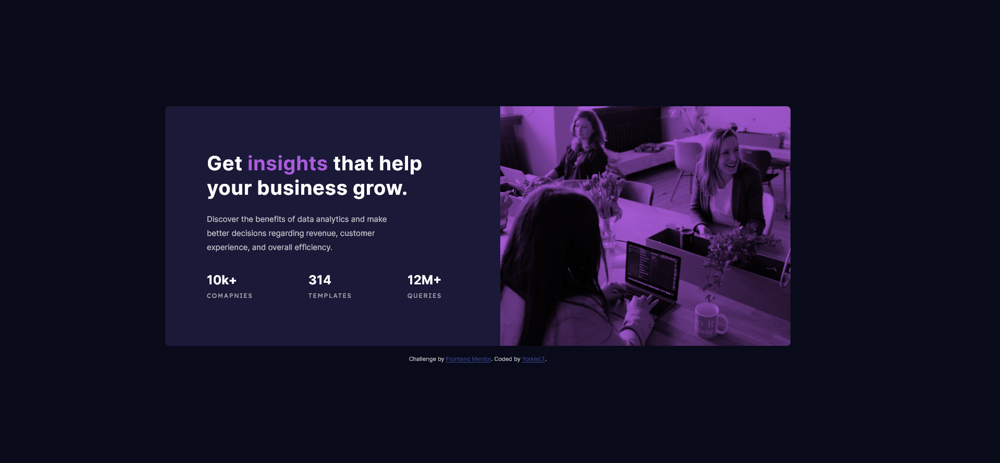

# Frontend Mentor - Stats preview card component solution

# Stats Preview Card Component

### Screenshot

## Table of contents

- [Overview](#overview)
  - [The challenge](#the-challenge)
  - [Screenshot](#screenshot)
  - [Links](#links)
  - [My process](#my-process)
  - [What I learned](#what-i-learned)
  - [Built with](#built-with)
  - [Useful resources](#useful-resources)

## Overview

## The challenge

Users should be able to:

- View the optimal layout depending on their device's screen size

### Links

- [🔴 Live Review](https://app.netlify.com/sites/polite-mermaid-5975bb/overview)
- [📝 Give feedback on my Frontend Mentor Solution](https://www.frontendmentor.io/solutions/responsive-stats-preview-card-component-using-css-gridflex-ju3ybw_jRP)

## My process
I will start with the `style-guide.md` file. Then I will try to gauge what fonts were used in which areas awhile making my --custom properties.

The hardest part for this challenge was the purple overlay. After some research and asking around in the [Slack](https://www.frontendmentor.io/slack) community, I decided to go with 'mix-blend-mode' on a pseudo element. It worked perfectly although I did have trouble with the background-color on my pseudo element constantly wanting to go past the image's width, I found putting a 'min-width: 100%' on the image stopped that from happening but I would like any suggestions on how I could have done it better as I feel it felt like a band-aid solution.

Just write `mix-blend-mode: multiply` on img style and write `background-color` on it's parent element.

I also wanted to better implement different units for what I need. I saw how some use 'pxs' for things like borders, 'rems' for everything else and then 'ems' for media queries, that is a pretty broad way of putting it but alas I did some research more on what situations would call for using all three so I experimented with them on this project.

For the responsiveness, I used a mix of Grid for the body and then Flexbox for everything else, any method would have worked on their own but I find it nicer using both if I can as it helps to gain practice in both.

### What I learned

* Using `mix-blend-mode` property.
* How to better implement different units, (px,rem,em).

## Built with

This project is created using **HTML5** and Pure **CSS3**.

  
  

## Useful resources

* [mix-blend-mode - CSS: Cascading Style Sheets | MDN](https://developer.mozilla.org/en-US/docs/Web/CSS/mix-blend-mode)
* [CSS values and units - Learn web development | MDN](https://developer.mozilla.org/en-US/docs/Learn/CSS/Building_blocks/Values_and_units)